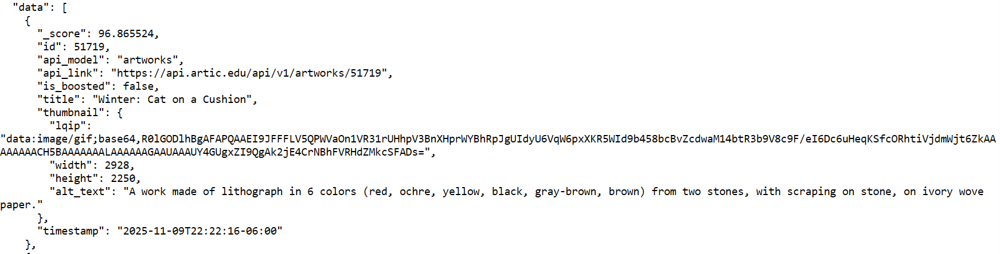

# Using APIs to Access an Art Collection

Using what we've learned about browser API calls and JSON, let's fetch some images and information about images from an art museum. The Art Institute of Chicago, made famous in the 1986 comedy *Ferris Bueller's Day Off*, offers a very handy and well document API service to patrons for free. [Their user-friendly introduction is here](https://api.artic.edu/docs/#quick-start).

First, let's follow their suggest to access the `/artworks/` endpoint containing all their published artworks by clicking here: [https://api.artic.edu/api/v1/artworks](https://api.artic.edu/api/v1/artworks). What do you notice?

Let's do a search for images that interest us. The Art Institute's documentation shows how to enter both free-form search terms and structured information an Api request using cats as an example:

> https://api.artic.edu/api/v1/artworks/search?q=cats&query[term][is_public_domain]=true

This little URL accesses the Artworks API's search endpoint, and users specify information requested after the `?` symbol. In this case, the search term after the parameter `q=` is "cats". Furthermore, we have specified that we want those works for which the `term` `is_public_domain` is set to `true`, meaning we can use it without any copyright complications. 

When we enter that URL in the browser, we can look for an image `title` that we might like. How would you get more information about it? Near the title, you should see an entry for `api_link`. Here's what it looks like for Théophile Steinlen's *Winter: Cat on a Cushion*:

If we navigate to this link, [https://api.artic.edu/api/v1/artworks/51719](https://api.artic.edu/api/v1/artworks/51719), we find a *lot* of information. All of this structured data can be used for analysis later on, especially if we capture the data on many different artworks. We can also use the information here to find an image file to see the artwork, as we shall see shortly. 

But how do we capture this data for usage on our own computers?  

[<<< Previous](curl.md)
